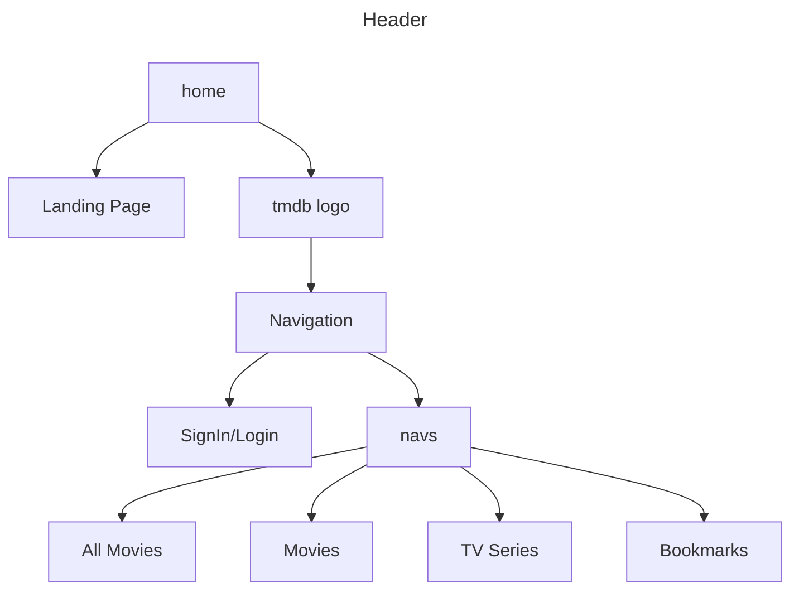
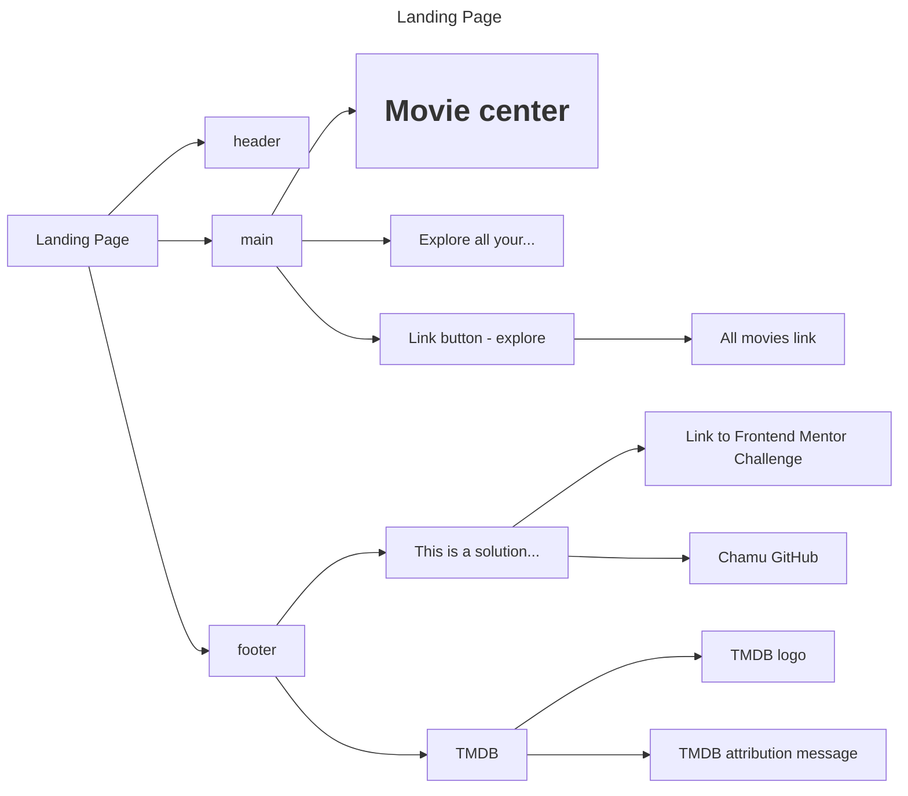
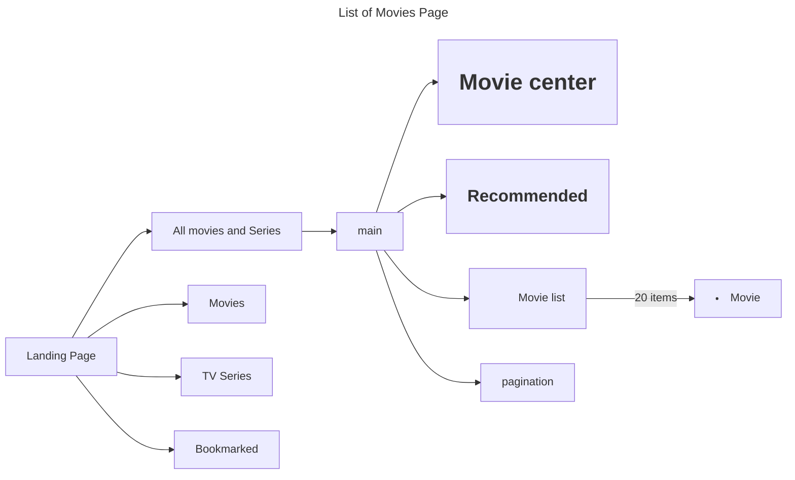
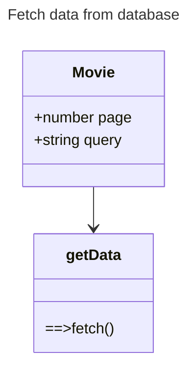
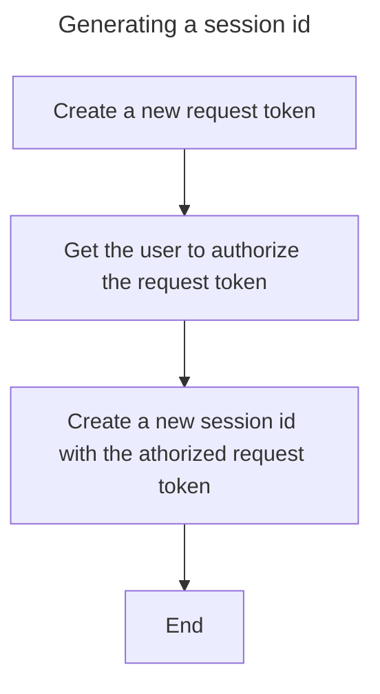

# Movie center web app

This is a [Next.js](https://nextjs.org/) project bootstrapped with [`create-next-app`](https://github.com/vercel/next.js/tree/canary/packages/create-next-app).

## Getting Started

First, run the development server:

```bash
npm run dev
# or
yarn dev
# or
pnpm dev
# or
bun dev
```

Open [http://localhost:3000](http://localhost:3000) with your browser to see the result.

You can start editing the page by modifying `app/page.tsx`. The page auto-updates as you edit the file.

This project uses [`next/font`](https://nextjs.org/docs/basic-features/font-optimization) to automatically optimize and load Inter, a custom Google Font.

## Adding the search functionality

[adding search](https://nextjs.org/learn/dashboard-app/adding-search-and-pagination#adding-the-search-functionality)

These are the Next.js client hooks that you'll use to implement the search functionality:

- useSearchParams- Allows you to access the parameters of the current URL. For example, the search params for this URL /dashboard/invoices?page=1&query=pending would look like this: {page: '1', query: 'pending'}.
- usePathname - Lets you read the current URL's pathname. For example, for the route /dashboard/invoices, usePathname would return '/dashboard/invoices'.
- useRouter - Enables navigation between routes within client components programmatically. There are multiple methods you can use.

## Suspense

Suspense lets you display a fallback until its children have finished loading.
In the code below, the `loading` component will be displayed until the `Movie` component is loaded

``` tsx
 <Suspense key={query + currentPage} fallback={<Loading />}>
                <Movie
                    data={
                        query === "" || queryData.results.length === 0
                            ? data
                            : queryData
                    }
                    path="/all/"
                />
 </Suspense>
```

## Flowchart diagrams



## The Landing Page

The landing page is comprised of the shared Header element , the main and the footer element. The workflow of the Landing page is shown below.



## The Movies page

The Flowchart for the movies pages is almost identical. The process is as below:

- when any of the links `all , movies, tv series` has been selected, a page is loaded with the respective movies.
- the `all movies` link has an additional search function
- when the movies are loaded , the user can view the detailed page by clicking on the movie



## Functions



## How do I generate a session id?


